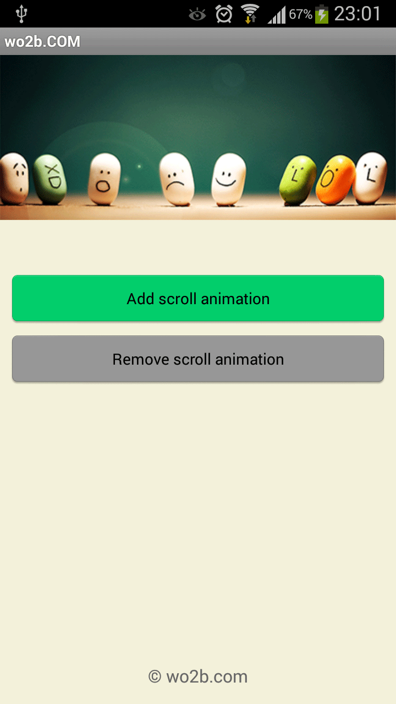
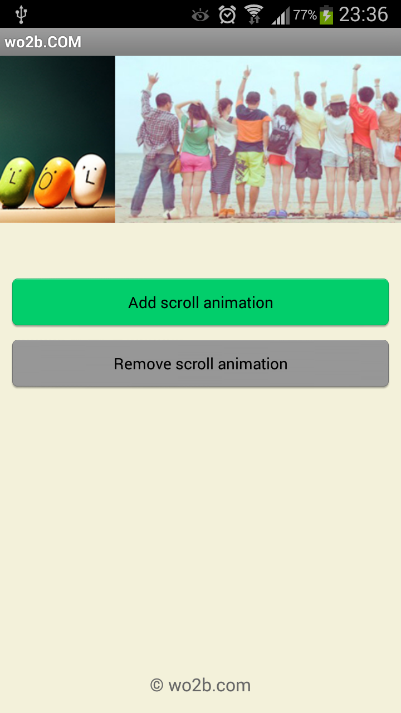
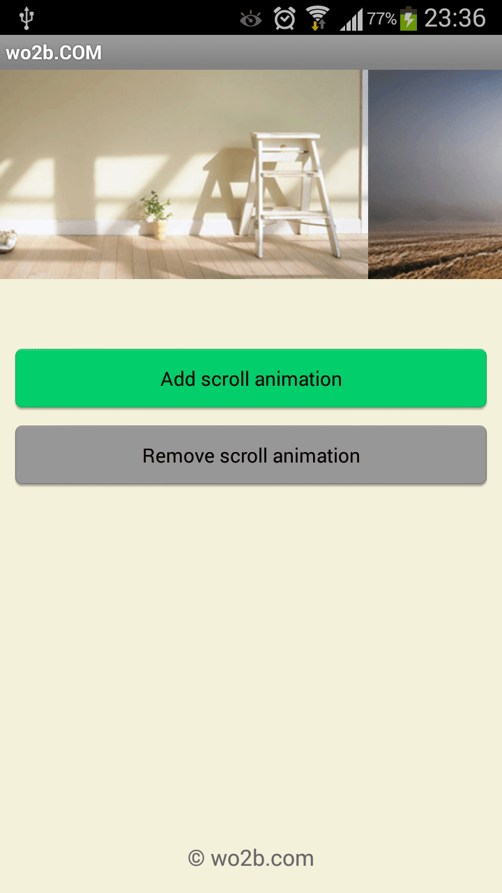

Android Auto Scroll ViewPager (Smooth)
==========================================================================================

[](http://www.wo2b.com) [](http://www.wo2b.com)


特性
------------
* 支持自动平滑切换海报、相册等，无限次循环轮播
* 手动切换时，轮播暂停，手指离开后，重新开始轮播
* 提供暂停、继续播放的api，想怎么控制由你决定
* 基类支持泛型，使用容易，可根据业务对象自行实现


版本
------------
``` java
android:versionCode="20151108"
android:versionName="2.0.0"
```

Android SDK最低支持到2.2


效果图
------------
<p>



</p>


更新日志
------------
2015-11-08: 代码移植到Android Studio，Gradle部署
 
其它
------------  
更多使用技巧, 请关注：  
[https://github.com/benniaobuguai/android-project-wo2b](https://github.com/benniaobuguai/android-project-wo2b)


### **License**

Copyright 2015 wo2b.com

Licensed under the Apache License, Version 2.0 (the "License");
you may not use this file except in compliance with the License.
You may obtain a copy of the License at

  http://www.apache.org/licenses/LICENSE-2.0

Unless required by applicable law or agreed to in writing, software
distributed under the License is distributed on an "AS IS" BASIS,
WITHOUT WARRANTIES OR CONDITIONS OF ANY KIND, either express or implied.
See the License for the specific language governing permissions and
limitations under the License.


